# Vota Dolores Hidalgo (vota_dh)
## Evidencia de Pruebas (TDD - Desarrollo Guiado por Pruebas)

### 1. Resumen General de Pruebas

---

### 2. Ciclo de Rondas (Rojo y Verde)

#### Ronda 1: Voto válido

- Verde (Prueba superada):

  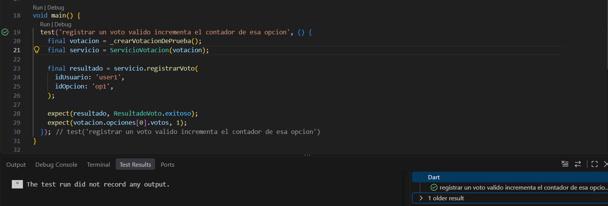

#### Ronda 2: Opción inválida

- Rojo (Fallo):

  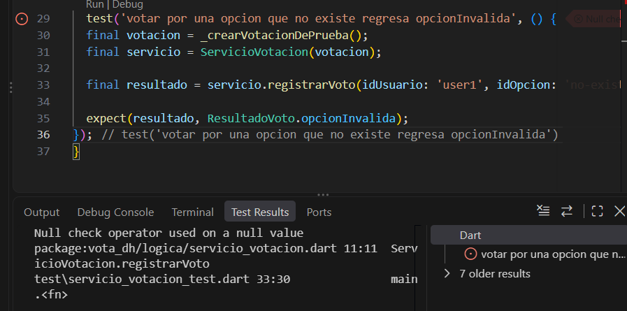

- Verde (Prueba superada):

  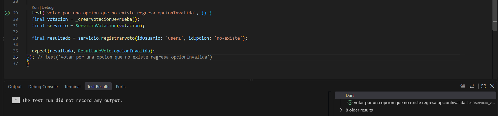

#### Ronda 3: Usuario repetido

- Rojo (Fallo por duplicidad):

  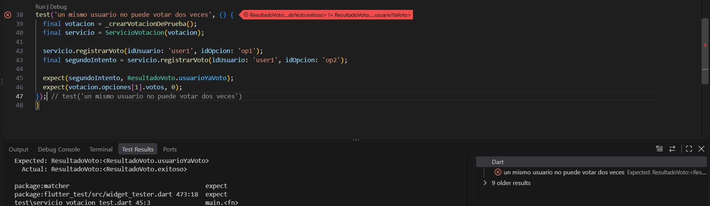

- Verde (Prueba superada):

  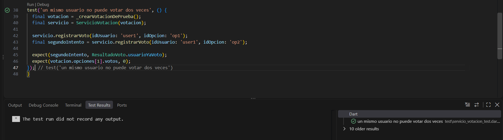

#### Ronda 4: Cálculo de porcentajes

- Verde (Prueba superada):

  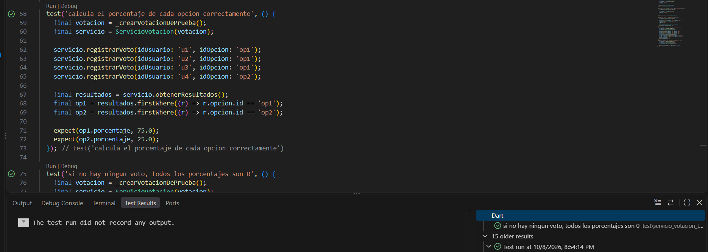

#### Ronda 5: Determinar ganador

- Rojo (Método faltante):

  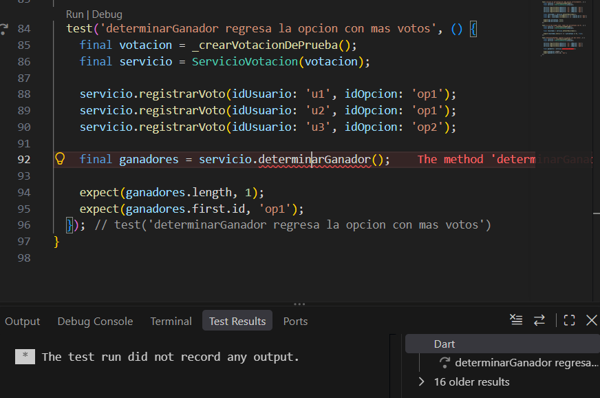

- Verde (Prueba superada):

  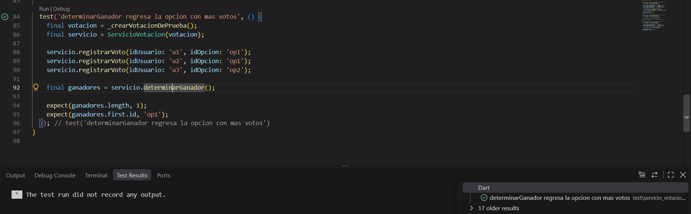

#### Ronda 6: Empate

- Verde (Prueba superada):

  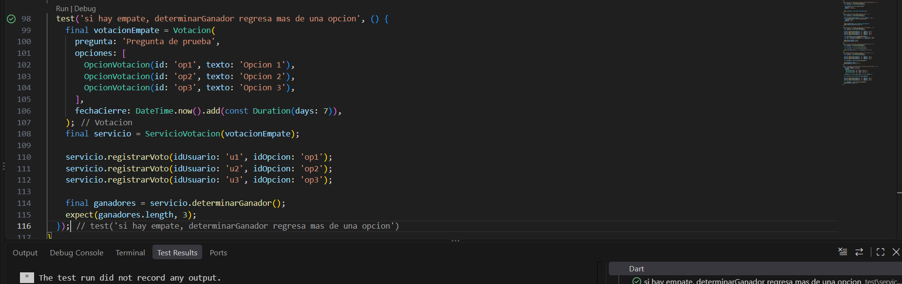

#### Ronda 7: Votación cerrada

- Rojo (Fallo):

  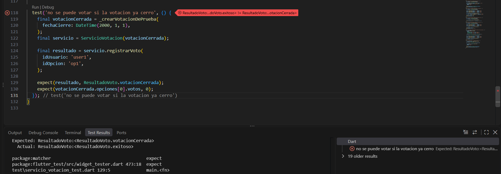

- Verde (Prueba superada):

  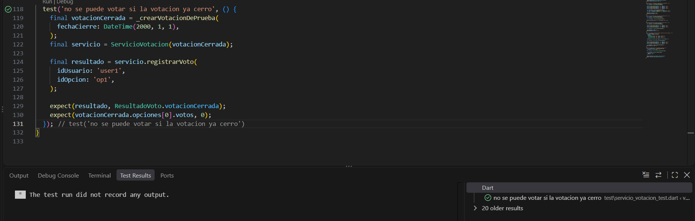

---

### 3. Prueba de integración completa

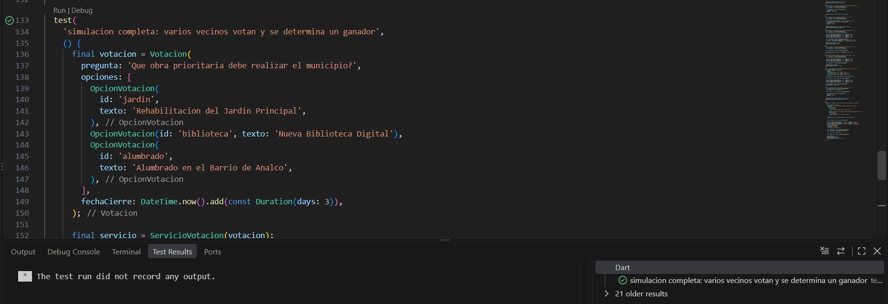

